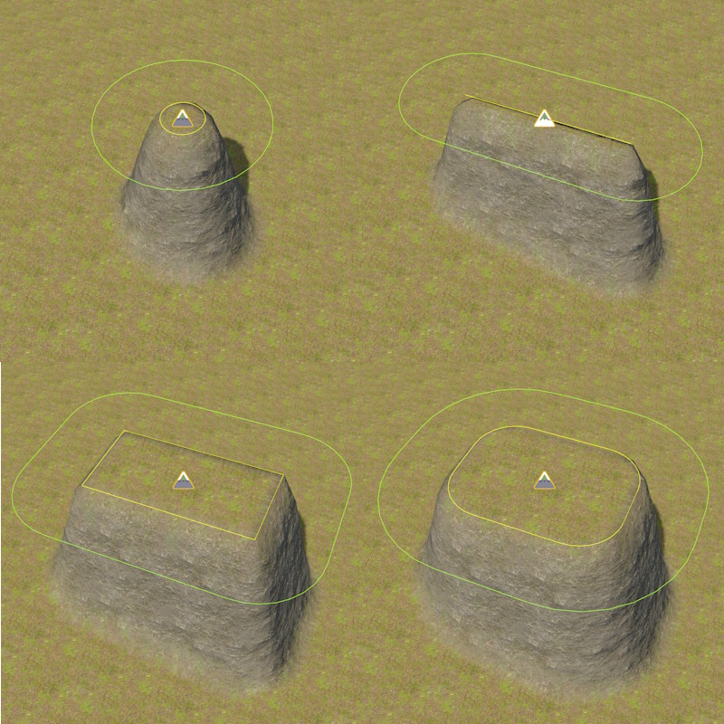
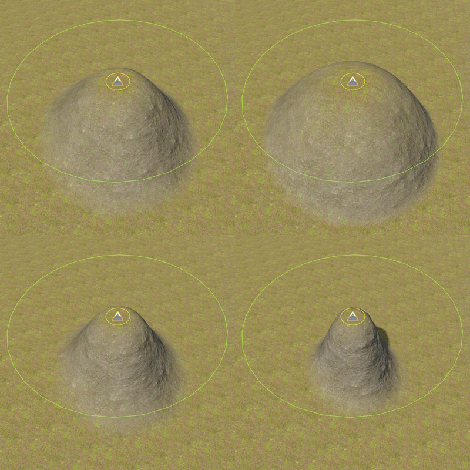
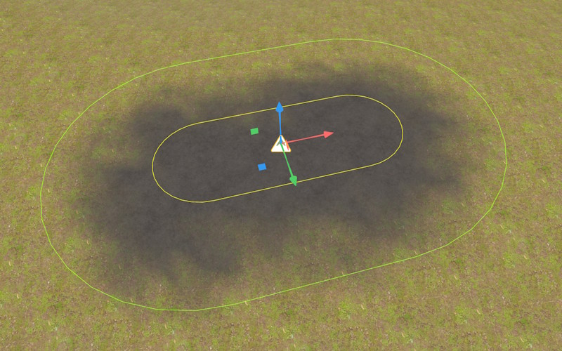
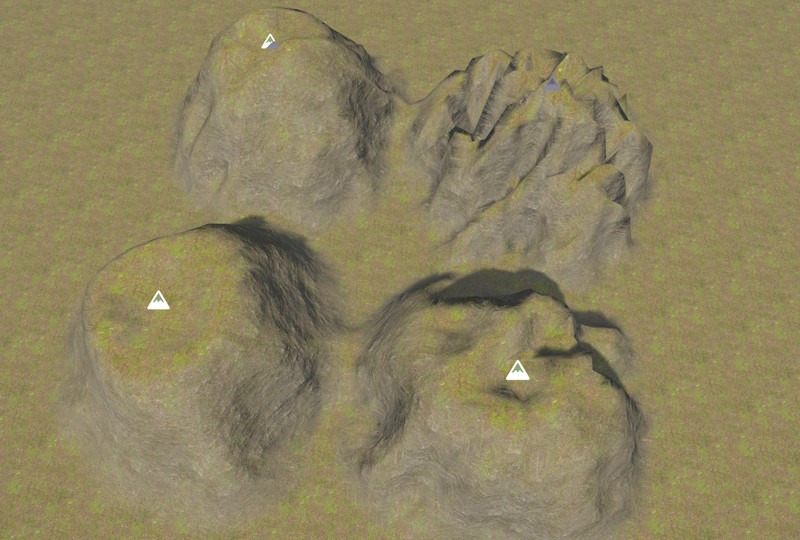
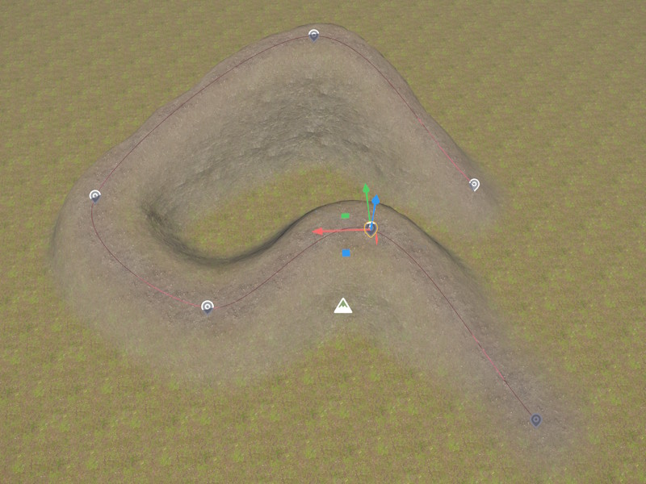

# Terrain Brush 2D Component

The *Terrain Brush 2D Component* modifies [terrain patches](terrain-patch-component.md) and [terrain volumes](terrain-volume-component.md) by raising or lowering it or painting a material onto it. Multiple brushes can overlap to form complex geometry.

<video src="media/terrain-brush-2d.mp4" autoplay controls></video>

For an overview of the terrain system, see [Terrain System](terrain-plugin-overview.md).

## Modify Modes

The `ModifyMode` property selects how the brush affects the terrain. **Raise** pulls the terrain up towards the brush, **Lower** pushes terrain down towards the brush. Vertices that are already above (when raising) or below (when lowering) the brush, are unaffected. **Set**, however, raises *and* lowers the terrain.

*Raise* is used to create mountains, *Lower* can be used to flatten an area, *Set* is useful for roads and riverbeds that are always at a fixed height.

**Paint Only** does not affect height, and only assigns a material. For material painting to work, `Material Strength` must be set to a non-zero value (usually `1`) and `Material Index` can then be used to select the material layer to paint.

## Footprint

The brush footprint is a rounded rectangle oriented by the owner object's rotation in the XY plane. The yellow line represents the inner shape, the green line the outer shape. The 2D brushes affect all terrain *below and above* them (depending on the *modify mode* they lower or raise the terrain).

`HalfSizeX`,`HalfSizeY` — Half-length of the straight edge along the local X and Y axis. Setting both to `0` produces a circle (top left image). Setting one to `0` produces a line (top right image).

`InnerRadius` — Corner rounding of the full-weight region. Setting this to zero produces a point or rectangle (bottom left image). Positive values give a circle (top left) or rounded rectangle (bottom right image)

`OuterRadius` — Corner rounding of the falloff zone. The outer edge of the brush is at *InnerRadius + OuterRadius*. Vertices between the inner and outer edge are blended using the *Falloff* exponent. Setting this to 0 gives a hard edge.

`Falloff` — Falloff between inner and outer radius. A falloff of `1` (top left image) results in a natural hill. `0.5` (top right image) and other values below `1` result in shapes more like domes or plateaus. `2` (bottom left), `5` (bottom right) and other values above `1` produce steep cliffs.

## Material Painting

Material painting let's you change the material layer that is used in some area. Material painting is activated by setting `MaterialStrength` to a non-zero value. If `ModifyMode` is set to *Paint Only*, the brush doesn't affect the geometry. In the example below, *noise* is also used, to make the pattern more natural.

`MaterialIndex` — The material layer index (0–31) to paint within the brush footprint.

`MaterialStrength` — Blend weight applied to *MaterialIndex* at the brush center. 0 disables painting; 1 fully assigns the material within the inner zone.

## Noise

Noise affects both geometry and material painting. Noise is used to introduce random patterns to make the result more natural. See the image below for an example where the same brush settings are used, only with varying noise strength and frequency.

`NoiseStrength` — Amount of noise applied to perturb the brush influence. 0 disables noise.

`NoiseFrequency` — Spatial frequency of the noise. Small values make the effect very local, producing high-frequency noise, higher values are useful for larger terrain features, like mountains.

## Shared Properties

`Priority` — Brush evaluation order. Brushes with higher priority are applied later and win over lower-priority brushes in the same region. It is very rarely necessary to adjust this, but if you have multiple brushes in the same area and one brush doesn't have the effect that you expect it to have, increase its priority, to make it more dominant.

`AffectPatches`, `AffectVolumes` — Whether the brush applies to [terrain patches](terrain-patch-component.md) or [terrain volumes](terrain-volume-component.md). By default 2D brushes only affect terrain patches, and 3D brushes only affect volumes.

`Tags` — When non-empty, the brush only affects terrain objects whose *TerrainTags* contain at least one matching tag. Empty tags match all terrain objects. This can be used on complex scenarios, to control precisely which brush affects which piece of terrain. For instance, you could place two heightfields above each other and now need to separate between brushes that affect the top or bottom one.

## Spline Brushes

When a [Spline Component](../animation/paths/spline-component.md) is attached to the same game object, the brush stamps along the full length of the spline. This is useful for mountain chains, roads, rivers and tunnels. The brush settings are the same everywhere along the spline, so to make a path wider at some point, you would either add another brush on top there, or stop the spline and start a new one, with different brush settings.

## See Also

* [Terrain System](terrain-plugin-overview.md)
* [Terrain Patch Component](terrain-patch-component.md)
* [Terrain Brush 3D Component](terrain-brush-3d-component.md)
