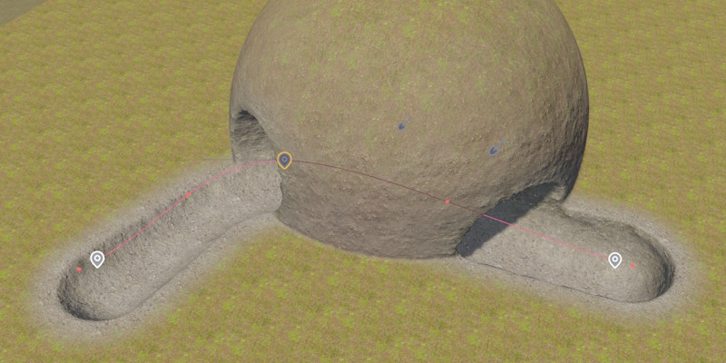

# Terrain Brush 3D Component

The *Terrain Brush 3D Component* modifies [terrain volumes](terrain-volume-component.md) by carving out or adding voxel geometry, or by painting a material layer onto the surface. It is the volumetric counterpart to the [Terrain Brush 2D Component](terrain-brush-2d-component.md) and shares a lot of properties with it.

<video src="media/terrain-brush-3d.mp4" autoplay controls></video>

For an overview of the terrain system, see [Terrain System](terrain-plugin-overview.md).

## Modify Modes

`ModifyMode` — How the brush affects the volume within its footprint.

| Mode | Description |
|------|-------------|
| `Carve` | Removes voxels within the brush's inner volume. |
| `Fill` | Adds voxels within the brush's inner volume. |
| `Paint Only` | Only paints the material layer, doesn't change geometry. The outer radius affects the material's fade distance. |

## Shape

The brush footprint is a 3D rounded box oriented by the owner object's rotation.

`HalfSizeX` — Half-length along the forwards axis.

`HalfSizeYTop`, `HalfSizeYBottom` — Half width at the top or bottom of the brush. By using a wider base, you can create more realistic tunnels.

`HalfSizeZ` — Half-length along the up axis.

For the remaining properties, see [Terrain Brush 2D Component](terrain-brush-2d-component.md#footprint).

## Spline Brushes

Spline support works the same way as for 2D brushes. Attaching a [Spline Component](../animation/paths/spline-component.md) to the same game object extrudes the brush volume along the spline. This is the best way to create tunnels and passages.

## See Also

* [Terrain System](terrain-plugin-overview.md)
* [Terrain Volume Component](terrain-volume-component.md)
* [Terrain Brush 2D Component](terrain-brush-2d-component.md)
