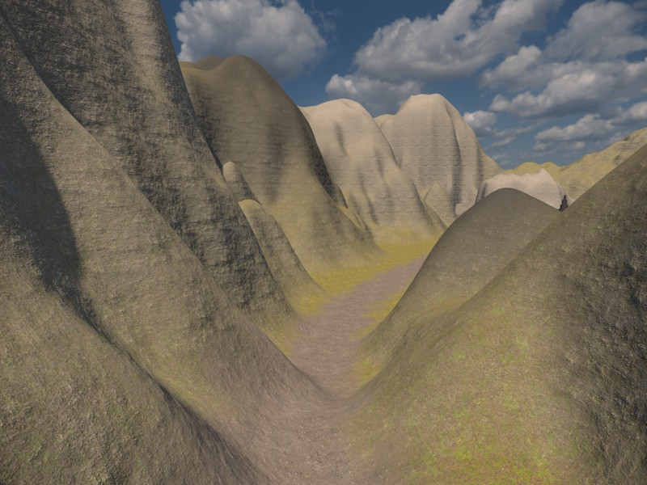
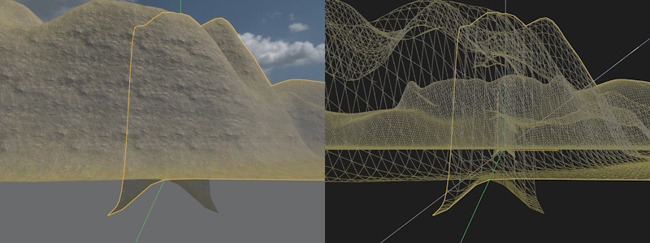
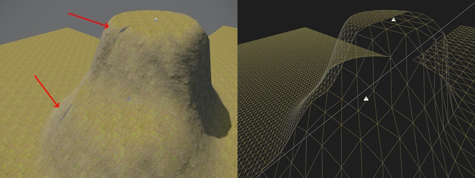

# Terrain Patch Component

The *Terrain Patch Component* renders a single heightfield tile. The terrain surface is defined by a grid of height values that are computed on the GPU by applying all overlapping brush components. Both [2D brushes](terrain-brush-2d-component.md) and [3D brushes](terrain-brush-3d-component.md) can affect a patch.

Terrain patches can only represent a single height value at each position. Therefore, they cannot form *overhangs* or *caves*. If such complex geometry is needed, use the [terrain volume component](terrain-volume-component.md).

For an overview of the terrain system, see [Terrain System](terrain-plugin-overview.md).

## Placement

You can place multiple terrain patches next to each other to cover large areas. Position each patch using its `Size` as the grid spacing, e.g. place patches with `Size` 64 exactly 64 units apart.

By default (unless `LodDistanceScale` is set to `0`), each patch renders a skirt: a downward strip of geometry around its border that overlaps into the neighboring patch. This hides the cracks that would otherwise appear where two patches meet, for instance if they render at different LOD levels, or use a different `Resolution`.

The image below shows what the expected overlap looks like. Here two patches are placed next to each other. Above ground they match perfectly, below ground you see the skirt geometry curving downwards.

The image below shows what those cracks would look like without a skirt (`LodDistanceScale` set to `0` on both patches) and a mismatched *vertex density* (ie `Size` / `Resolution`):

## Editing

Terrain patches are mostly edited through [2D terrain brushes](terrain-brush-2d-component.md). These are used to raise or lower the terrain and paint material layers on top. You can **cut holes** into terrain patches with [3D terrain brushes](terrain-brush-3d-component.md) by setting them to *Carve* and enabling *Affect Patches*. This is mainly useful to cut entrances for caves. You will then need to model the entrance in some other way, either by placing some [mesh](../graphics/meshes/meshes-overview.md) or using the [terrain volumes](terrain-volume-component.md). Note, that modeling the transition from terrain into a cave is quite tricky to get right.

## Performance

A good density for terrain patch vertices and quads is **half a meter** between vertices. So if your patch has a `Size` of 128 meters, use a `Resolution` of 256.

The renderer only culls entire patches, so prefer to use multiple smaller patches, than few huge ones. Also only place patches where you need them. If your level is long and thin, don't use patches that are much wider, rather place multiple thin ones in a row.

Terrain patches are much more memory efficient than [terrain volumes](terrain-volume-component.md). Use patches to cover large areas, use volumes only in places where you need overhangs. However, the pixel shader for patches can be more demanding, since terrain patches are able to blend many more material layers. If you determine that the material is too expensive, you can use a custom [terrain material](terrain-materials.md) that blends fewer layers or does less complex operations.

### Level of Detail (LOD)

Terrain patches automatically reduce their triangle count when the vertex density on screen exceeds what's needed, fading between LOD levels as the patch moves closer to or farther from the camera. LOD0 is the full resolution, LOD1 halves the vertex density in each direction (1/4 the triangle count), and LOD2 halves it again (1/16 the triangle count).

The detail level is controlled by the CVar `Terrain.LodTargetCoverage`, which specifies the target screen-space size of a single grid cell. The `LodDistanceScale` property allows to fine tune this per patch.

By default, *skirt* polygons are rendered around the border of each patch. This is a downward strip of geometry that overlaps with the neighboring patches, and is used to hide the cracks that would otherwise appear at the seam between patches, when neighboring patches render at different LOD levels or use different resolutions to begin with. The skirt is disabled when `LodDistanceScale` is set to 0.

## Component Properties

`Size` — World-space side length of the patch. Combined with *Resolution*, this determines the distance between vertices.

`Resolution` — Number of quads per side. Higher resolutions produce finer detail but increase memory consumption.

`Material` — The [material](../materials/materials-overview.md) used to render the patch. Must use a heightfield-compatible shader. See [Terrain Materials](terrain-materials.md).

`HeightImage` — Optional grayscale [ImageData asset](../misc/imagedata-asset.md) used as a baseline height source. Brushes are applied on top of this image, not instead of it. When no image is assigned the baseline height is zero.

  * `HeightImageOffset`, `HeightImageSize` — UV offset and extent to select which part of the image will be used.

  * `HeightImageScale` — Multiplier used to scale the height image values.

  * `BaseMaterialIndex` — The material layer (0–31) assigned to vertices not covered by any brush.

`LodDistanceScale` — Scales the distance at which this patch switches [LOD](#level-of-detail) levels. `1` uses the default distance (as configured by the `Terrain.LodTargetCoverage` CVar), values above `1` switch LOD later (at a greater distance, keeping detail longer), values below `1` switch earlier. Set to `0` ("LOD Disabled") to always render the patch at full resolution; this also turns off the skirt, since it is only needed to hide seams against a coarser LOD neighbor.

`Collider` — Controls whether and at what detail a physics collision shape is generated at scene export time. Lower values save memory, but lose detail. Colliders are  needed when using [procedural object placement](procedural/procedural-object-placement.md). When possible, deactivate colliders (for far away terrain that's only there for decoration) or reduce its detail.

`Surfaces` — Per-material-index [physics surface](../materials/surfaces.md) array. Entry *i* is the surface used where material index *i* is dominant. Used to control physics behavior such as footstep sounds and friction per material layer.

`TerrainTags` — Identity [tags](../projects/tags.md) assigned to this patch. A brush only affects this patch when the brush's own tags are either empty or contain at least one tag that matches. This can be used to apply brushes to only very specific objects and is only needed when you use multiple patches or [terrain volumes](terrain-volume-component.md) on top of each other to form complex geometry. For instance you can rotate a terrain patch such that it points downward, to form the ceiling of a cave. In this case you may want to apply some brushes only to the floor and others only to the ceiling.

## See Also

* [Terrain System](terrain-plugin-overview.md)
* [Terrain Brush 2D Component](terrain-brush-2d-component.md)
* [Terrain Brush 3D Component](terrain-brush-3d-component.md)
* [Terrain Materials](terrain-materials.md)
