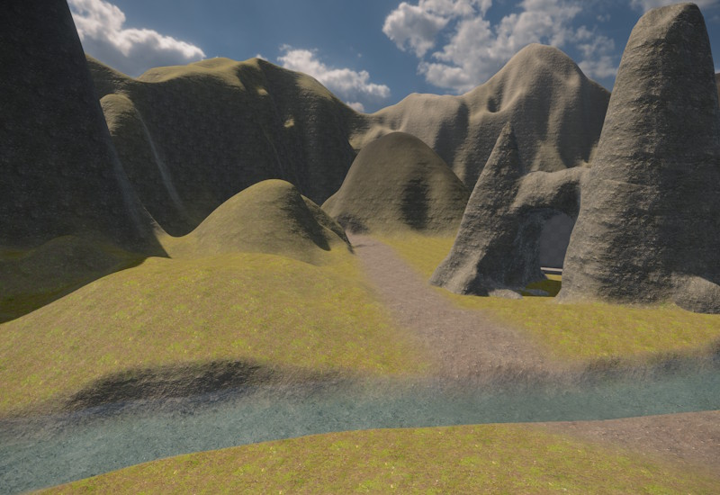

# Terrain System

The terrain system provides tools for creating both heightfield terrain and voxel terrain, using a non-destructive brush workflow.

## Terrain Types

Two terrain component types are available:

* **[Terrain Patch](terrain-patch-component.md)** — a flat heightfield tile. Each vertex has a height value. Suitable for large open landscapes.
* **[Terrain Volume](terrain-volume-component.md)** — a voxel volume. The surface is reconstructed from a 3D density field. Suitable for caves, overhangs, arches, and other shapes that a heightfield cannot represent.

Both types can be combined in the same scene.

## Non-Destructive Brush Editing

Terrain is shaped by placing **brush components** in the scene. Brushes are never destructive: the engine reapplies all active brushes each time the terrain is rebuilt, so any brush can be moved, resized, or deleted at any time without permanently altering the data.

Both brush types can affect both terrain patches and terrain volumes. Each brush has *AffectPatches* and *AffectVolumes* toggles to limit which terrain types it modifies.

The two brush types differ in how they compute their area of influence:

* **[Terrain Brush 2D](terrain-brush-2d-component.md)** — projects downward. It affects all terrain within its XY footprint, regardless of height. The brush height defines the target height for raising, lowering, and set operations. Use this for shaping ground surfaces and painting material across large areas.
* **[Terrain Brush 3D](terrain-brush-3d-component.md)** — a volumetric rounded box. It only affects terrain that lies inside the 3D shape. Use this for carving caves, adding rock formations, or any operation that must be confined to a specific region in 3D space.

Brushes are game objects. Moving a brush object in the editor immediately updates the terrain preview.

## Patches vs. Volumes

**Terrain patches** are well suited for large open areas — rolling hills, plains, valleys. They are GPU-efficient and support rich per-vertex material blending: up to four material layers can blend across each quad. However, a heightfield can only represent a single height per XY position, so overhangs and caves are not possible.

**Terrain volumes** support full 3D shapes, making them the right choice for caves, tunnels, arches, and anything that must be modeled in three dimensions. Their material support is more limited: the volume has one base layer and each vertex can have one painted override. Only a single transition is possible at a time. To work around this, multiple smaller volumes can be placed side by side, each with a different base layer, and brush painting used to blend at the seams.

Both types can coexist in the same scene and are designed to be combined. A typical setup might use a heightfield for the open landscape, a 3D brush to carve an opening into it, and a voxel volume positioned around the entrance and below ground to model the cave interior.

**Seamless adjacency:** Patches tile seamlessly with each other when placed edge to edge at the same vertex density. Volumes also tile seamlessly with other volumes at the same voxel size. Placing a patch next to a volume does not produce a seamless join — the surface reconstruction methods differ and the geometry will not line up. Some creativity is needed to hide the transition, such as overlapping the two types, placing props to cover the seam, or using a 3D brush to create a transition zone.

## Spline Brushes

If a [Spline Component](../animation/paths/spline-component.md) is attached to the same game object as a brush, the brush stamps along the full length of the spline instead of acting at a single point. This is useful for roads, river beds, trenches, and tunnels.

## Collision

Collision shapes are **not generated at runtime**. They are baked to disk when the scene is exported. Changes made to brushes will not affect collision until the scene is re-exported.

## Dynamic Modifications

It is technically possible to modify the terrain visuals *in-game* by adding, removing or modifying terrain brushes. All affected terrain will automatically be regenerated. However, *physics colliders* cannot be updated dynamically this way. You can still use this for scripted modifications, for instance to cover a cave entrance with dirt, if you take care of toggling a collider object yourself. You can also use this for purely visual changes, for instance you can change the material layer used on backdrop mountains to toggle whether they have snow on their peaks.

## Limitations

* **No LOD for terrain volumes.** [Terrain patches](terrain-patch-component.md) automatically [reduce detail at a distance](terrain-patch-component.md#level-of-detail), but [terrain volumes](terrain-volume-component.md) have no level-of-detail support and always render at full detail.
* **Collision baked at export.** Terrain with collision meshes cannot change collision shape at runtime (see [Collision](#collision)). Visual changes still work.
* **One material override per voxel.** Terrain volumes support only a single painted override per vertex — no blending multiple overrides at same spot.

## See Also

* [Terrain Patch Component](terrain-patch-component.md)
* [Terrain Volume Component](terrain-volume-component.md)
* [Terrain Brush 2D Component](terrain-brush-2d-component.md)
* [Terrain Brush 3D Component](terrain-brush-3d-component.md)
* [Terrain Materials](terrain-materials.md)
