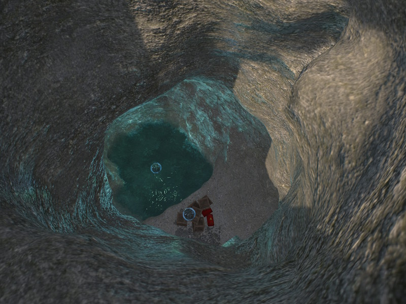
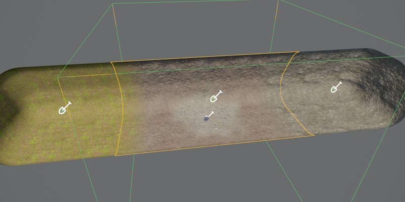

# Terrain Volume Component

The *Terrain Volume Component* renders a voxel terrain volume. Unlike a heightfield, a voxel volume can represent overhangs, caves, arches, and tunnels. The surface mesh is generated on the GPU and updated whenever overlapping brush components change. Both [2D brushes](terrain-brush-2d-component.md) and [3D brushes](terrain-brush-3d-component.md) can affect a volume.

For an overview of the terrain system, see [Terrain System](terrain-plugin-overview.md).

## Placement

Volumes tile seamlessly with other volumes as long as the *voxel size* is identical (`Size` / `Resolution`). Placing a volume next to a [terrain patch](terrain-patch-component.md) does not produce a seamless join, since the two surface reconstruction methods differ — use overlapping terrains or props to hide the seam.

**Working around the single-material-transition limit:** unlike a terrain patch, which can blend up to four material layers per quad, a volume vertex only stores one base layer (`BaseMaterialIndex`) plus one painted override. That means a single volume can only ever show *one* transition — for example rock fading into dirt — anywhere brush painting overlaps the base layer. If you need three or four distinct materials, for example for a tunnel to transition from grass to dirt, then to rock, while also using mossy patches here and there, one volume can't hold all of them at once.

The workaround is to split the tunnel into multiple smaller volumes, each given its own `BaseMaterialIndex` — one volume set to grass, an adjacent one set to dirt, another set to rock. Since volumes tile seamlessly at matching voxel size, the pieces still form one continuous surface. Brush painting is then only used locally, near each seam, to blend the transition between two neighboring base layers — so every seam gets its own one-layer blend instead of asking a single volume to blend everything at once. At the places where no override material is needed for a transition, it is then possible to paint mossy spots, as well.

See [Terrain Materials](terrain-materials.md) for how base layers and painted overrides work.

## Editing

Volumes are shaped with [3D terrain brushes](terrain-brush-3d-component.md), used to add or carve solid geometry to form caves, tunnels, arches, and overhangs. [2D brushes](terrain-brush-2d-component.md) can affect volumes too, projecting downward to raise, lower, or paint material regardless of the 3D shape underneath.

## Performance

Terrain volumes are more memory- and GPU-intensive than [terrain patches](terrain-patch-component.md). Use volumes only where overhangs or caves are actually needed, and prefer patches to cover large open areas.

Higher `Resolution` values increase voxel density and bake time. Since the surface mesh regenerates whenever an overlapping brush changes, keep `Resolution` no higher than necessary for the detail the volume needs.

## Component Properties

`Resolution` — Number of voxels per axis. Higher resolutions produce finer detail but increase GPU memory and bake time.

`Size` — World-space side length of the cubic volume. Dividing *Size* by *Resolution* gives the world-space size of one voxel.

`Material` — The [material](../materials/materials-overview.md) used to render the generated mesh. Must use a voxel-compatible shader. See [Terrain Materials](terrain-materials.md).

`BaseMaterialIndex` — The material layer assigned to voxels not covered by any brush paint operation.

`FillHeight` — Local-space Z height used to split the initial volume into solid (below) and air (above) before brushes run. With the default value, the volume starts entirely empty.

`EnableCollider` — When enabled, a [Jolt triangle mesh](../physics/jolt/collision-shapes/jolt-collision-meshes.md) collision shape is baked to disk at scene export time. Disable for purely visual volumes.

`CleanupIterations` — Number of topology cleanup passes applied after voxel baking. Each pass removes isolated voxels and spike geometry. Higher values yield a smoother result at the cost of slightly longer bake times. Only necessary on volumes that use brushes with strong noise.

`Surfaces` — Per-material-index [physics surface](../materials/surfaces.md) array. Entry *i* is the surface used where material index *i* is dominant. Used to control physics behavior such as footstep sounds and friction per material layer.

`TerrainTags` — Identity [tags](../projects/tags.md) assigned to this volume. A brush only affects this volume when the brush's own tags are either empty or contain at least one tag that matches. This can be used to apply brushes to only very specific objects and is only needed when you use multiple [patches](terrain-patch-component.md) or volumes on top of each other to form complex geometry.

## See Also

* [Terrain System](terrain-plugin-overview.md)
* [Terrain Brush 2D Component](terrain-brush-2d-component.md)
* [Terrain Brush 3D Component](terrain-brush-3d-component.md)
* [Terrain Materials](terrain-materials.md)
